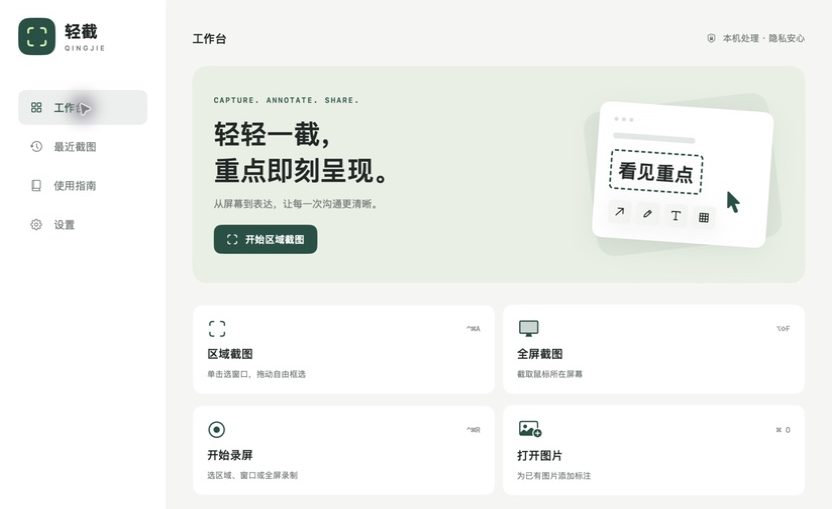

# 轻截

一款轻巧的原生 macOS 截图、录屏与标注工具。截取画面、标出重点、复制分享，日常操作随手完成。

## 能做什么

- **截图**：自由框选、自动识别窗口、全屏截图，也能滚动截取长图。
- **标注**：箭头、文字、矩形、画笔和马赛克，截完直接编辑。
- **录屏**：录制区域、窗口或整个屏幕，支持系统声音、麦克风和鼠标点击效果，保存为 MP4。
- **美化**：为截图添加圆角与阴影，复制或保存为透明 PNG。
- **图片工具**：打开已有图片编辑、贴图置顶、本机中英文文字识别，以及最近截图回看。
- **随手调用**：菜单栏常驻、自定义快捷键、开机启动和应用内更新。

截图、录屏与文字识别都在本机处理，无需注册账号。

## 下载使用

前往 [下载最新版](https://github.com/Stubsx/qingjie/releases/latest)，下载 ZIP 安装包，解压后将「轻截」拖入「应用程序」。

目前支持 **Apple Silicon Mac · macOS 14 及以上**，录屏需要 **macOS 15 及以上**。首次使用需授予屏幕录制权限；开启麦克风录音时会另行请求授权。

应用尚未经过 Apple 公证，首次打开若被系统拦截，可在「系统设置 → 隐私与安全性」中选择「仍要打开」。

默认快捷键：**⌥⇧A** 区域截图 · **⌥⇧F** 全屏截图 · **⌥⇧R** 开始 / 停止录屏，可在设置中修改。

[MIT License](LICENSE)
